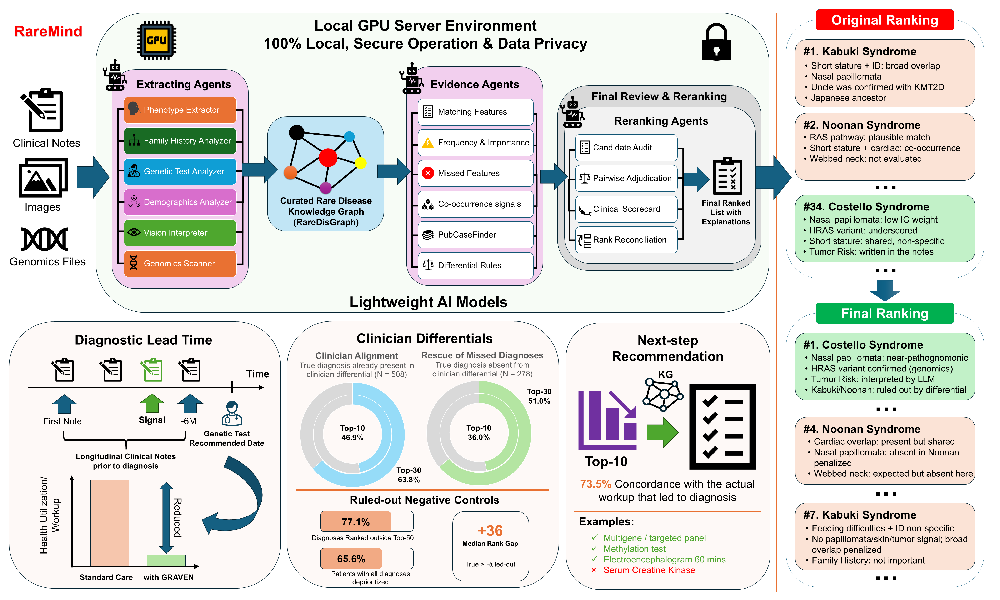

<div align="center">

# 🧬 RareDisGraph-MultiAgentLLM

### A Locally Deployable Multi-Agent System for Rare Disease Prioritization

[](LICENSE)
[](https://www.python.org/)
[](https://github.com/vllm-project/vllm)
[](#-privacy--phi-compliance)

**RareDisGraph-AgenticAI** pairs a curated rare disease knowledge graph with a single open-weight language model to prioritize diagnoses from clinical cases — all on your own hardware, no patient data ever leaves the machine.



*Fig. 1 — Full pipeline: multimodal evidence extraction → KG-grounded scoring → LLM reranking → ranked diagnostic output.*

---

[📄 Paper](#-citation) · [🗄️ RareDisGraph KG](https://github.com/WGLab/RareDisGraph-Extraction) · [🐛 Issues](https://github.com/WGLab/RareDisGraph-MultiAgentLLM/issues) · [✉️ Contact](#-contact)

</div>

---

## 📋 Table of Contents

- [Overview](#-overview)
- [Key Features](#-key-features)
- [System Requirements](#-system-requirements)
- [Installation](#-installation)
- [Download Required Files](#-download-required-files)
- [Configuration](#-configuration)
- [Running the Pipeline](#-running-the-pipeline)
- [Input Formats](#-input-formats)
- [Output Format](#-output-format)
- [Evaluation](#-evaluation)
- [Privacy & PHI Compliance](#-privacy--phi-compliance)
- [Citation](#-citation)
- [Contact](#-contact)

---

## 🔭 Overview

Matching a patient to one of more than 7,000 rare diseases requires weighing phenotype specificity, inheritance patterns, hallmark features, differential-diagnosis rules and family history — all at once. Most software handles only one of these.

**RareDisGraph-AgenticAI** integrates all of them in a single local pipeline:

1. **Extract** — A set of agents powered by a single open-weight LLM reads the clinical case and extracts HPO terms, family history, demographics and genetic evidence directly from free text. No pre-curated HPO terms required.
2. **Score** — Candidates are scored against **RareDisGraph**, a MONDO-anchored knowledge graph built from GeneReviews, OMIM and Orphanet (15,817 diseases · 387,060 HPO-linked phenotype assertions · 67,234 differential-diagnosis edges) using an information-content-weighted composite score that mirrors how a geneticist thinks.
3. **Rerank** — The same LLM audits the top 30 candidates against their RareDisGraph entries, runs pairwise comparisons using the graph's differential-diagnosis edges, and produces a PageRank-aggregated reranked list.
4. **Output** — A ranked top-10 list with a traceable evidence scorecard for each candidate.
---

## ✨ Key Features

| Feature | Description |
|---|---|
| 🏠 **Fully local** | All inference runs on your own GPU — no API calls, no data transmission |
| 🔒 **PHI-safe** | Patient data never leaves your machine |
| 📝 **Free-text input** | Accepts raw clinical notes directly — no pre-curated HPO terms needed |
| 🧬 **Knowledge-graph grounded** | Scoring and reranking use RareDisGraph, not unconstrained model knowledge |
| 👨‍👩‍👧 **Family history & demographics** | Parses pedigree patterns and infers inheritance priors automatically |
| 🖼️ **Multimodal** | Optional facial photograph → HPO terms via vision-language model |
| 🧪 **VCF support** | Optional genomic variant input adds gene-level evidence |
| ⚡ **Fast** | ~4–5 min per case on a single A100-40GB with Qwen3-8B |
| 🔍 **Interpretable** | Every output includes the graph features and audit notes that drove each rank |

---

## 💻 System Requirements

| Component | Qwen3-8B (default) | MedGemma-27B |
|---|---|---|
| GPU | 1× A100 40 GB | 1× H100 80 GB |
| RAM | 32 GB | 64 GB |
| Python | 3.9+ | 3.9+ |
| CUDA | 11.8+ | 12.1+ |
| OS | Linux (Ubuntu 20.04+) | Linux (Ubuntu 20.04+) |

> **No quantization is used.** Both backbones run at full precision on the stated hardware.

---

## 🛠️ Installation

### 1. Clone the repository (the name of the pipeline is subject to change)

```bash
git clone https://github.com/WGLab/RareDisGraph-MultiAgentLLM.git
cd RareDisGraph-MultiAgentLLM
```

### 2. Create and activate a virtual environment

```bash
python -m venv venv
source venv/bin/activate
```

### 3. Install dependencies

```bash
pip install -r requirements.txt
pip install -e .
```

> If you encounter CUDA version conflicts with vLLM, follow the [vLLM installation guide](https://docs.vllm.ai/en/latest/getting_started/installation.html) for your specific CUDA version.

---

## 📥 Download Required Files

### RareDisGraph Knowledge Graph

```bash
# Download the RareDisGraph KG (~2 GB)
wget -O data/RareDisGraph.pkl \
  https://github.com/WGLab/RareDisGraph-Extraction/releases/download/v1.0/RareDisGraph.pkl
```

> The download link will be live upon publication. Contact us to request early access.

### HPO and MONDO Ontologies

```bash
# Human Phenotype Ontology
wget -O data/hp.obo \
  https://github.com/obophenotype/human-phenotype-ontology/releases/latest/download/hp.obo

# MONDO disease ontology
wget -O data/mondo.obo \
  https://github.com/monarch-initiative/mondo/releases/latest/download/mondo.obo
```

### Verify your setup

```bash
ls -lh data/
# RareDisGraph.pkl   ~2.0 GB
# hp.obo          ~200 MB
# mondo.obo       ~150 MB
```

---

## ⚙️ Configuration

Copy the default config and edit as needed:

```bash
cp configs/default_config.yaml configs/my_config.yaml
```

Key fields:

```yaml
model:
  backbone: "Qwen/Qwen3-8B"          # or "google/medgemma-27b-it"
  gpu_memory_utilization: 0.90
  max_model_len: 16384

paths:
  RareDisGraph_path: "data/RareDisGraph.pkl"
  hpo_obo_path:   "data/hp.obo"
  mondo_obo_path: "data/mondo.obo"

scoring:
  graph_blend_weight: 0.65            # 65% KG score + 35% reranked score
  top_k_candidates: 100
  top_k_rerank: 30

pipeline:
  use_family_history: true
  use_demographics:   true
  use_vision:         false           # set true if facial photos provided
  use_vcf:            false           # set true if VCF provided
```

---

## 🚀 Running the Pipeline

### Single case

```bash
python scripts/run_pipeline.py \
  --input  data/examples/case.txt \
  --config configs/my_config.yaml \
  --output results/output.json
```

### With facial photograph and/or VCF

```bash
python scripts/run_pipeline.py \
  --input  data/examples/case.txt \
  --image  data/examples/face.jpg \
  --vcf    data/examples/variants.vcf \
  --config configs/my_config.yaml \
  --output results/output.json
```

### Batch evaluation on a cohort

```bash
python scripts/run_batch.py \
  --input_dir  data/cohorts/HMS/ \
  --config     configs/my_config.yaml \
  --output_dir results/HMS/ \
  --n_workers  4
```

---

## 📂 Input Formats

The pipeline accepts several input types. See data/examples/{modality} for templates.

###### Modality (name of the input folder): text | free_hpo | image | vcf

#### 📝 Text — free-text clinical note (.txt)
Patient is a 6-year-old male referred for evaluation of global developmental delay,
autistic features and seizures. Born to non-consanguineous parents. He sat independently
at 12 months and walked at 28 months. No speech. Exam shows microcephaly (HC -2.8 SD),
hypotonia and bilateral simian creases.
Family history: a maternal cousin has a similar presentation.

#### 🧬 Free HPO terms — semicolon-separated (.txt)
HP:0001249; HP:0000729; HP:0001250; HP:0000252; HP:0001290; HP:0000316

#### 🖼️ Facial photograph — vision pathway (.png, .jpg, .jpeg)

Provide a frontal facial photograph. The vision agent converts it into HPO terms automatically and merges them with any text-derived phenotypes before scoring.

```bash
  python scripts/run_pipeline.py \
    --input data/examples/case.txt \
    --image data/examples/face.png \
    --config configs/my_config.yaml \
    --output results/output.json
```

#### 🧪 Genomic variants — VCF file (.vcf)

A VCF file adds gene-level evidence. The pipeline extracts candidate genes from the variant calls and adds a gene-evidence bonus to candidates whose causal genes overlap.

```bash
python scripts/run_pipeline.py \
  --input data/examples/case.txt \
  --vcf   data/examples/variants.vcf \
  --config configs/my_config.yaml \
  --output results/output.json
```

All input types can be combined. For example, a text note + HPO terms + facial photo + VCF can all be passed together and the pipeline will merge the evidence from each source before scoring.
---

## 📊 Output Format

Each run produces a JSON file with the top-10 ranked diagnoses and a full evidence scorecard per candidate:

```json
{
  "patient_id": "CASE_001",
  "top_diagnoses": [
    {
      "rank": 1,
      "mondo_id": "MONDO:0010726",
      "disease_name": "Angelman syndrome",
      "gene": "UBE3A",
      "kg_score": 0.847,
      "final_score": 0.891,
      "scorecard": {
        "matching_phenotypes": ["HP:0001249", "HP:0000729", "HP:0001250"],
        "hallmark_match": "HP:0000729 (autistic features) — HIGH SPECIFICITY",
        "missing_hallmarks": [],
        "contradictions": [],
        "audit_note": "Strong match on autistic features and seizures. No contradictions.",
        "pairwise_wins": 8,
        "pairwise_losses": 1
      }
    }
  ],
  "pipeline_metadata": {
    "backbone": "Qwen/Qwen3-8B",
    "kg_version": "v1.0",
    "runtime_seconds": 287,
    "not_found": false
  }
}
```

---

## 🔒 Privacy & PHI Compliance

This system was designed for use with real patient data in clinical environments:

- ✅ **No API calls** — every LLM step runs on your local GPU
- ✅ **No telemetry** — no usage data is collected or transmitted
- ✅ **No cloud storage** — all inputs and outputs stay on your machine
- ✅ **Suitable for PHI** — compatible with HIPAA-conscious deployment on institutional hardware

> You are responsible for ensuring your computational environment meets your institution's data-governance requirements before processing real patient data.

---

## 📄 Citation

If you use RareDisGraph-MultiAgentLLM in your research, please cite:

```bibtex
@article{nguyen2025RareDisGraph,
  title   = {A locally deployable multi-agent system for rare disease
             prioritization using a curated knowledge graph and
             open-weight language models},
  author  = {Nguyen, Quan M. and Wang, Kai},
  journal = {Under review},
  year    = {2026},
  note    = {Under review},
  url     = {https://github.com/WGLab/RareDisGraph-MultiAgentLLM}
}
```

Also cite the RareDisGraph knowledge graph:

```bibtex
@software{RareDisGraph2025,
  author = {Nguyen, Quan Minh and Wang, Kai},
  title  = {RareDisGraph: A MONDO-anchored rare disease knowledge graph
            integrating GeneReviews, OMIM and Orphanet},
  year   = {2025},
  url    = {https://github.com/WGLab/RareDisGraph-Extraction}
}
```

---

## 📬 Contact

For questions, bug reports or collaboration inquiries:

| Name | Role | Email |
|---|---|---|
| **Quan Minh Nguyen** | Lead developer · PhD Student, University of Pennsylvania | [nguyenqm@chop.edu](mailto:nguyenqm@chop.edu) |
| **Kai Wang** | Principal Investigator · Children's Hospital of Philadelphia | [wangk@chop.edu](mailto:wangk@chop.edu) |

For bugs and feature requests please open a [GitHub Issue](https://github.com/WGLab/RareDisGraph-MultiAgentLLM/issues).

---

<div align="center">

**Wang Genomics Lab** · Children's Hospital of Philadelphia · University of Pennsylvania

[](https://github.com/WGLab)

</div>
